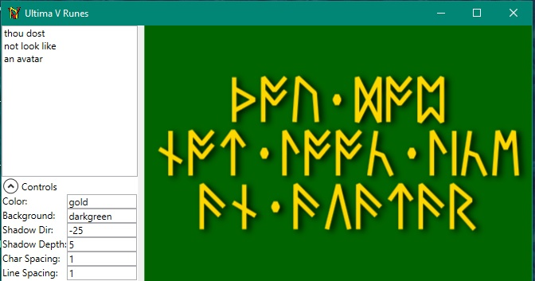

# Ultima V Tools

This is a repo where I'll be consolidating various scripts and
utilities I've written for fun as I replay one of my favorite old games,
Ultima V.

This is the main branch, and it is Windows-centric with WPF/Powershell apps.  
There are other branches with java and lua code, in various stages of completion.  I may
or may not ever go back to those.

## RuneFonts

This is a font (in TTF, WOFF, and SVG formats) that contains
the ultima runes from [Runes-C.ttf](https://www.dafont.com/ultima-runes.font), but
with added ligatures so you can type `th`, `ng`, `ee`, `ea`, and `st` directly and
get the special characters.  This makes typing in the font a LOT more convenient.

## WPF U5Runes App

In the `WPF-Utilities` folder, there's a WPF app which draws whatever you type in the runes
used by the series. You have control over the colors,
spacing, and shadows:

## Powershell Module

I made a powershell module, in the `Powershell-Module` folder.  This module lets you inspect and
modify `SAVED.GAM` files.  An easy way to check on a game, or give yourself a much-needed food or
some torches.

